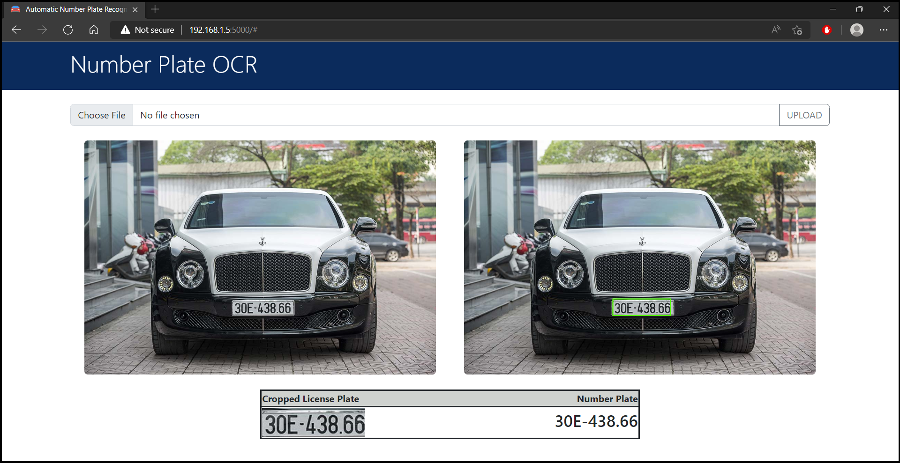

## License Plate Recognition


### Introduction
License plate detection is identifying the part of the car that is predicted to be the number plate. Recognition is identifying the values that make up the license plate. License plate detection and recognition is the technology that uses computer vision to detect and recognize a license plate from an input image of a car.
<p align='middle'></p>


### Setup
* The instruction below is done on Windows 10.
* [Download](https://www.python.org/downloads/) python, and create virtual environment with specific python version.
    ```
    virtualenv <ENV_NAME> --python=python3.7
    ```
* Activate the environment.
    ```
    . <ENV_NAME>/scripts/activate
    ```
* Automatically install all dependencies from `requirements.txt`.
    ```
    pip install -r requirements.txt
    ```


### How to use
* Step 1:
    * For YOLOv3, download file [here](https://www.mediafire.com/file/a38cal86u81z3xc/yolov3.weights/file) and put into `yolov3` folder.
    * For YOLOv7, we do not need to do anything. See the training process with custom data [here](https://drive.google.com/drive/folders/1Knm_rgt1XC8J4ohcrlha7biFYgkJzouP?usp=sharing).
* Step 2: Configure hyper-parameters in `config.py` file. There are many hyper-parameters which can be configured, but I recommend focus on these ones:
    * `HOST`: Server domain.
    * `PORT`: Server port.
    * `YOLO_VERSION`: YOLO version, currently only support version 3 and 7.
    * `YOLO_WEIGHT`: YOLO weight.
    * `YOLO_CONFIG`: YOLO configuration.
* Step 3: Start server.
    ```
    python app.py
    ```
<p align='middle'></p>


### References
[Aslan Ahmedov (2022). Automatic Number Plate Recognition.](https://www.kaggle.com/datasets/aslanahmedov/number-plate-detection)